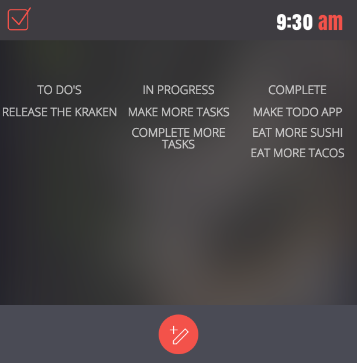

# Project Summary
---
Create an interactive "to-do" list with vanilla JavaScript

With this to-do app, users will be able to:

* Create new todo items.

* Move the items from 'New' to 'In Progress' to 'Archived' to deleted



##Step 1

### Setup

1. Fork and clone this repo
2. Open `index.html`
3. Now, let's create a folder called `app`. This is where we will store the guts of our app.
4. Inside the app folder let's make a folder called `scripts`. This is where we will store all our Javascript.
5. Inside the `scripts` folder we will create our main Javascript file named `app.js`.
6. Add the `app.js` file to be loaded in the `index.html` file.

> Hint:
>
> A lot of times errors in the beginning of a project are because the files are not properly linked.
>
> Your browser will read your index.html from top-to-bottom, left-to-right. This means that if you add
> script tags in an incorrect order it could result in errors.


# Step 2
### Basic Architecture

We are going to be creating a todo list. So the easiest way to store a list of things is to create an array!

*app.js*
```javascript
const list = [];
```

Listo will be our main array for storing tasks.

Now, we don't want to just store strings. Instead, we will store Task objects into our array. Because our users are going to be making a lot of Tasks we should perhaps streamline the object creating process with a **constructor**

*app.js*
```javascript
function Task(task) {
  this.task = task;
  this.id = 'new';
}
```


We now have an array to push our tasks onto and a task constructor so our users can create object tasks for their lists.

The next thing we want is the ability for a user to write a todo task into our `index.html` and save it to the array.

Let's hop over to our `index.html` and create a space for them to type in their list items.

> Hint:
>
> There is a comment in the index.html file for where you should place the html markup shown below.

*index.html*
```html
<section id="newTaskForm">
  <h3 class="todo-form-title">New To Do </h3>
  <div  class="form-input-container">
    
    <input id="newItemInput" class="todo-title-input form-input" type="text" placeholder="To-Do Title">
    <button  id="saveNewItem" class="complete-todo-button">Add To Do</button>
  </div>
</section>
```

This will create a form with a save and cancel button. We want to give the save and cancel buttons IDs
so that we can call them with JavaScript. We also want to give the form an ID so it can be accessed as well.

You will come to see that most elements in our html will have an ID. That is so that JavaScript has
a lot of hooks to make contact with what it is looking to manipulate.

One more thing, make sure you've added your `app.js` file to the `index.html`

*index.html*
```html
<script src="./app/scripts/app.js"></script>
```

### Making our addTask function

When we enter something into the input field and hit save, we want to create an object and push it to our array.

Let's make a function to do that for us.

*app.js*

```javascript
function addTask(task) {};
```

We don't want people to be able to create blank tasks, that would be a little frustrating. Let's put a conditional in the function so that it only runs if our task is there.

*app.js*
```javascript
function addTask(task) {
  if(task) {}
};
```

Now our code will only run if 'task' is "truthy". Empty tasks are not truthy since they're just empty strings.

Next, we want to call our task constructor and fill it with the new task, then we will push the new task to listo, and save it.

*app.js*
```javascript
function addTask(task) {
  if(task) {
    task = new Task(task);
    listo.push(task);
  }
};
```

There are a few things we should add to this function to make it work correctly. First, we want the
input form to clear after we submit it, which currently isn't happening. Then we want to make it so
we can show our new list item in our `index.html`.

*app.js*

```javascript
function addTask(task) {
  if (task) {
    const newTask = new Task(task);
    list.push(newTask);
    document.getElementById('newItemInput').value = '';

    const taskElem = document.createElement('li');
    taskElem.id = 'item';

    const item = document.getElementById('newList').appendChild(taskElem);
    item.innerHTML = `
        <a id="new" class="list-group-item">
          ${newTask.task}
        </a>
      `;
  }
}
```

First, we should make it so that our newTaskForm is hidden when the document loads. Let's put this
near the top of our document so that it loads correctly.

*app.js*
```javascript
const newTaskForm = document.getElementById('newTaskForm')
newTaskForm.classList.toggle('hide')
```

Then, let's add the toggle so that our New button will hide and show the input form at the same time.

*app.js*
```javascript
function addTask(task) {
  if (task) {
    const newTask = new Task(task);
    list.push(newTask);
    document.getElementById('newItemInput').value = '';

    const taskElem = document.createElement('li');
    taskElem.id = 'item';

    const item = document.getElementById('newList').appendChild(taskElem);
    item.innerHTML = `
        <a id="new" class="list-group-item">
          ${newTask.task}
        </a>
      `;
  }

  newTaskForm.classList.toggle('hide');
}
```

We will now add an event handler that calls the `addTask` function when we click the saveNewItem button element.

*app.js*
```javascript
document
  .getElementById('saveNewItem')
  .addEventListener('click', function(event) {
    event.preventDefault();
    const task = document.getElementById('newItemInput').value.trim();
    addTask(task);
  });
```

Finally, let's make it so that we can open and close the new task form with the newListItem and Cancel button.

*app.js*
```javascript
//Opens form
document.getElementById('add-todo').addEventListener('click', function() {
  newTaskForm.classList.toggle('hide');
});

document.getElementById('cancel').addEventListener('click', function(event) {
  event.preventDefault();
  newTaskForm.classList.toggle('hide');
});
```

Test out the application, you should be able to add tasks to the todo list.

## Step 3

### Task Progression HTML

Before we make it possible to move our tasks from in-progress to archived, we want create a space
for them to exist in our HTML. We will do this by adding some markup to the `index.html`.

All we really need to do is create divs with ULs within them that contain the IDs our JavaScript will look for.
Or in other words, let's make some hooks for our JavaScript to find and manipulate!

Inside the todo-main-container add this html markup:

*index.html*
```html
<div class="progress-box">
  <h3>In Progress</h3>
  <ul class="list-group" id="currentList"></ul>
</div>

<div class="progress-box">
  <h3>Complete</h3>
  <ul class="list-group" id="archivedList"></ul>
</div>
```

## Step 4
### Starting, Finishing, and Deleting Tasks

The next thing we want is to create a way for our tasks to be moved from **new**, to **in progress**,
to **archived**, and eventually deleted.

If you remember, when we created our task constructor we took in the argument for task, and we also
created an ID that was automatically set to 'new'. In order to transition a task from 'new' to 'inProgress'
all we really need to do is update the object's ID so that it says 'inProgress' and move that element
to the **inProgress** list.

First let's make a function that allows us to change the status of an item from 'new' to 'inProgress'.

Let's add an event listener to the `newList` element that will move the **new** list item that is clicked
to the `inProgress` list.

*app.js*
```javascript
document.getElementById('newList').addEventListener('click', function(event) {
  if (event.target.matches('a.list-group-item')) { // matches is a method available on an Element, it checks if the element matches the specified selector (just like a CSS selector)
    event.target.id = 'inProgress';
    document.getElementById('currentList').append(event.target);
  }
});
```
You'll notice this is a little different than some of the previous event listeners we've been setting up.
This listener is not attached directly to the list item, it's attached to the container that contains all of
the list items. The reason for this is becuase list items are dynamically created, meaning those elements are
created after the webpage has rendered. The challenge this presents is that we would need to add an event listener
to those elements every time we create a new one. This is possible, but it is easier to add the event listener to
the container and let the event **bubble** from the contained list items. Event **propagation** or **bubbling** is
an important concept in JavaScript and is essential to understanding events and eventListeners.

> Read More about Events: https://eloquentjavascript.net/15_event.html

So we can now move items from **new** to **inProgress**. Let's setup another event handler to move from
**inProgress** to **archived**.

*app.js*
```javascript
document
  .getElementById('currentList')
  .addEventListener('click', function(event) {
    if (event.target.matches('a.list-group-item')) {
      event.target.id = 'archived';
      document.getElementById('archivedList').append(event.target);
    }
  });
```

Ok now we need to be able to delete items from archived.

*app.js*
```javascript
document
  .getElementById('archivedList')
  .addEventListener('click', function(event) {
    if (event.target.matches('a.list-group-item')) {
      const itemText = event.target.innerText
      list.splice(list.findIndex(function(item) { return item.task === itemText }, 1))
      event.target.remove();
    }
  })
```

We should now have a working todo list application. As you can see, even for basic functionality,
it takes a fair amount of JavaScript to get it working. We did this using nothing but JavaScript
and the native methods that the browser provides us by default. We'll learn how to do similar things
in the future utilizing JavaScript frameworks that make much of what we did easier.


# Finished

Open up a pull request to the repository you forked this project from.
